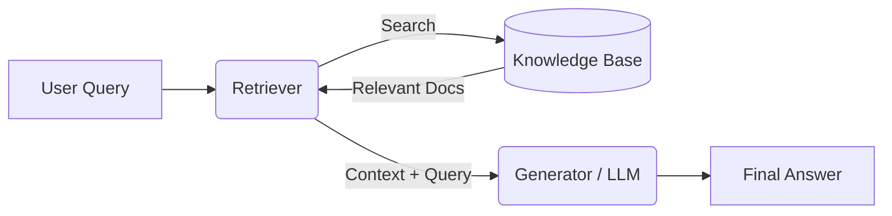

# 01 Basic RAG: The Concept

This folder demonstrates the fundamental concept of **Retrieval-Augmented Generation (RAG)** without any complex dependencies or vector databases.

## Key Concepts

1.  **Retrieval**: Finding the most relevant pieces of information (chunks) from your knowledge base that match the user's query.
2.  **Augmentation**: inserting those retrieved "chunks" into the prompt sent to the LLM (Language Model).
3.  **Generation**: The LLM uses the provided context to generate an accurate answer.

## The Flow



## How to Run

1.  Ensure you have Python installed.
2.  Run the script:
    ```sh
    python simple_rag.py
    ```

## Files

-   `simple_rag.py`: A dependency-free Python script simulating the RAG process using basic string matching and mock generation.
