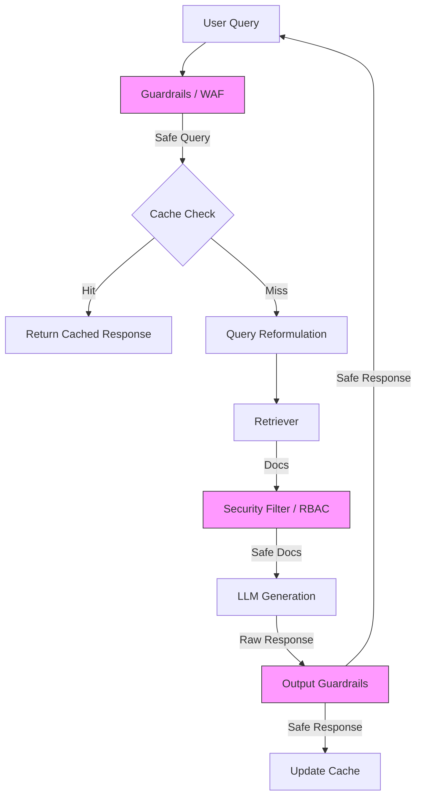

# 08 Production Challenges: Real-World Deployment

Moving RAG systems from proof-of-concept to production introduces a new set of complexities. This section covers the critical operational aspects required for a robust, secure, and scalable system.

## Key Challenges

1.  **Security**: Protecting the system from attacks and ensuring data safety.
    *   **Prompt Injection**: Preventing malicious inputs that manipulate LLM behavior.
    *   **Data Leakage**: Ensuring the LLM doesn't reveal sensitive information from the training data or context window.
    *   **Access Control**: Implementing RBAC (Role-Based Access Control) for document retrieval.

2.  **Compliance**: Adhering to legal and regulatory standards.
    *   **GDPR/HIPAA**: Managing "Right to be Forgotten" and handling PII (Personally Identifiable Information).
    *   **Audit Logging**: Tracing every query, retrieved document, and generation for accountability.

3.  **Scaling & Performance**: Handling increased load efficiently.
    *   **Latency**: Reducing the time to first token (TTFT) and total generation time.
    *   **Throughput**: Managing concurrent users.
    *   **Caching**: Implementing semantic and exact caching to reduce costs and latency.

## Production Architecture

## Topics Covered

### Operations
*   **Security**: Implementation of input/output guardrails.
*   **Compliance**: Strategies for PII redaction and audit trails.
*   **Scaling**: Techniques for efficient vector search and model serving.

## Files

-   `01_operations.py`: A script demonstrating basic patterns for security checks and logging in a RAG pipeline.
