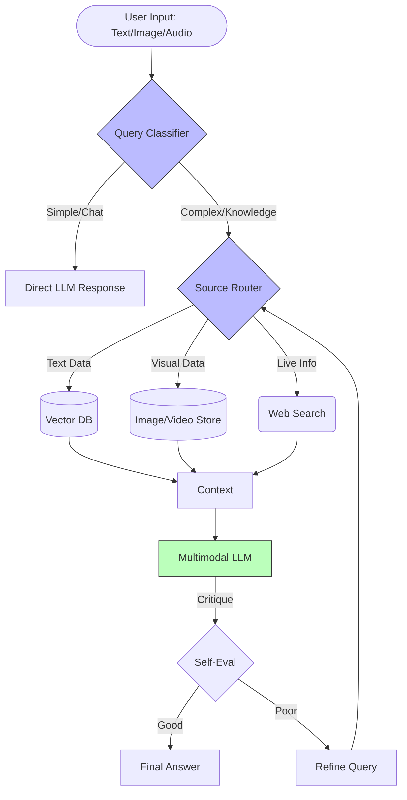

# 09 Future Directions: Next Generation RAG

As Large Language Models evolve, RAG is moving beyond simple text-based retrieval. This section explores the cutting-edge frontiers that are shaping the next generation of intelligent systems.

## Key Trends

1.  **Multimodal RAG**: Handling mixed media types.
    *   **Cross-Modal Retrieval**: Querying with text to find images, or using images to find text.
    *   **Unified Embeddings**: Using models (like CLIP or Gemini) that map different modalities into a shared vector space.
    *   **Video & Audio RAG**: Retrieving specific segments from rich media files based on semantic content.

2.  **Adaptive RAG**: Smart, dynamic retrieval strategies.
    *   **Self-Correction**: The model evaluates its own retrieved context and decides if it needs to search again.
    *   **Router Systems**: Dynamically choosing between different retrieval sources (web search vs. private DB vs. internal knowledge) based on query complexity.
    *   **No-Retrieval Fallback**: Intelligently deciding when *not* to use RAG for simple conversational queries.

## Future Architecture: Multimodal & Adaptive

## Topics Covered

### Emerging Technologies
*   **Multimodal**: integrating non-text data into the retrieval pipeline.
*   **Adaptive**: Building systems that "think" before they retrieve.

## Files

-   `01_multimodal_rag.py`: Placeholder for exploring multimodal embedding and retrieval concepts.
-   `02_adaptive_rag.py`: Placeholder for logic demonstrating adaptive query routing.
